# TrustGate Android

I built TrustGate Android to show how a mobile client can treat device integrity as a risk signal before allowing sensitive actions.

It is not a banking app and it is not bypass-proof security. It is a public-safe Android security lab covering device-risk checks, sensitive action gating, request signing, secure local storage, and local security events.

## What It Proves

- Device-risk signal collection from root, emulator, debugger, and installer-source checks
- Risk-based gating for a payment-like action
- Local security event logging that explains decisions taken by the app
- HMAC request signing shape with deterministic tests
- Encrypted local storage for mock session and risk state
- Certificate pinning example code that stays disabled by default
- Kotlin-first Android structure with unit tests and CI

## App Flow

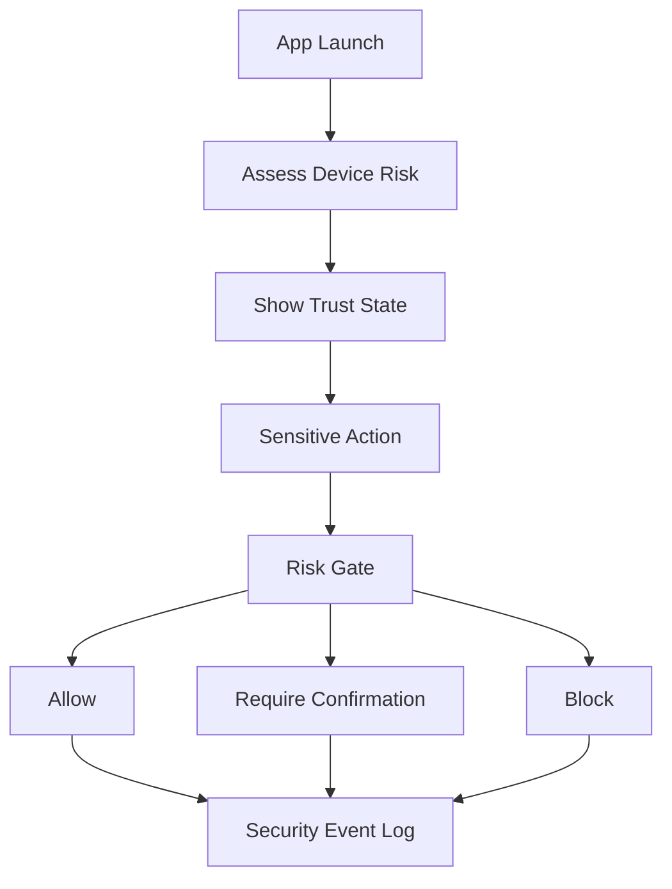

## Screenshots

Real screenshots for the app, tests, CI, and repository are committed under [`docs/screenshots`](docs/screenshots). The full capture notes live in [docs/SCREENSHOT_GUIDE.md](docs/SCREENSHOT_GUIDE.md).

<table>
  <tr>
    <td>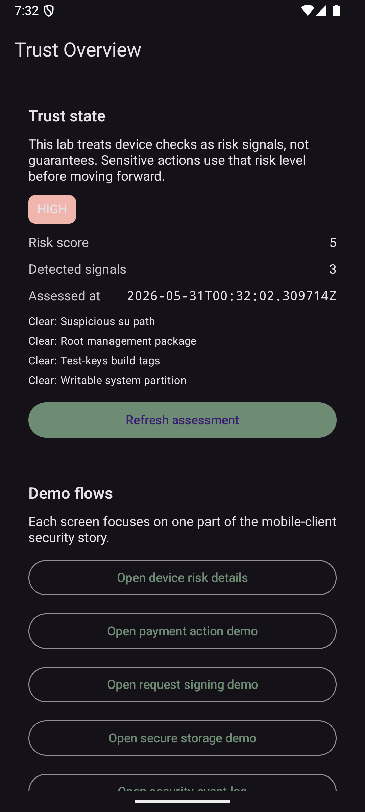<br />Trust overview</td>
    <td>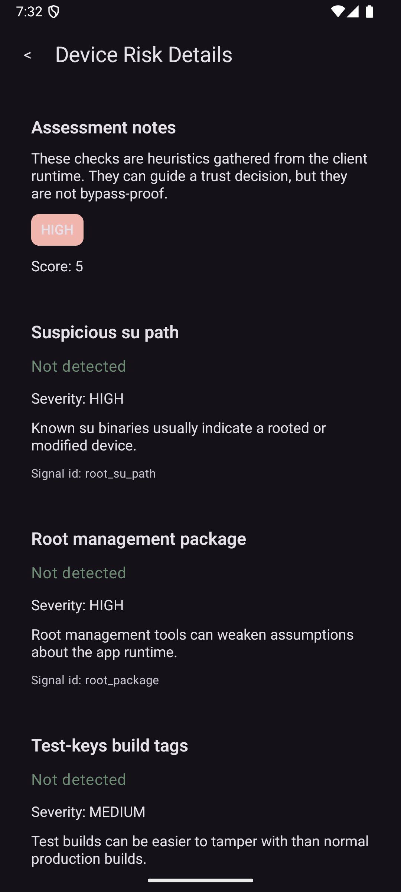<br />Device risk details</td>
  </tr>
  <tr>
    <td>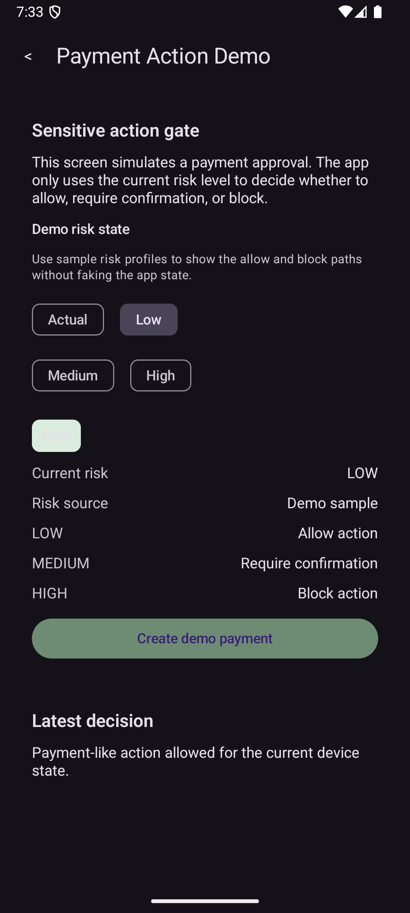<br />Sensitive action allowed</td>
    <td>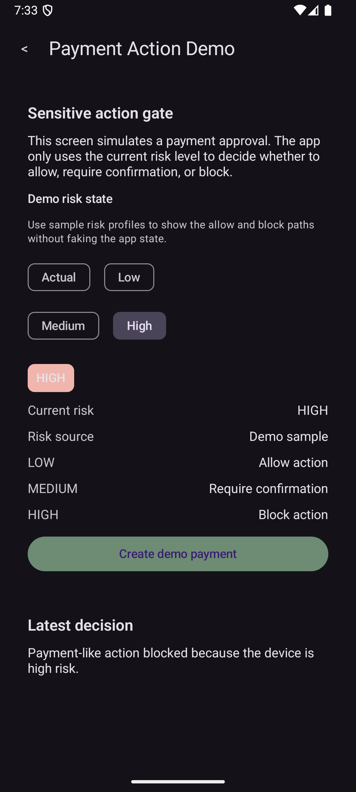<br />Sensitive action blocked</td>
  </tr>
  <tr>
    <td>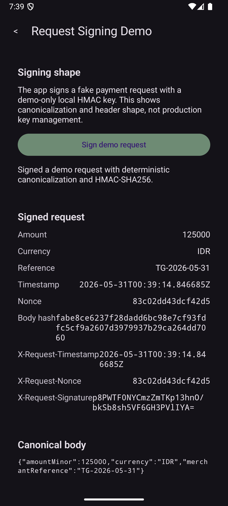<br />Request signing demo</td>
    <td>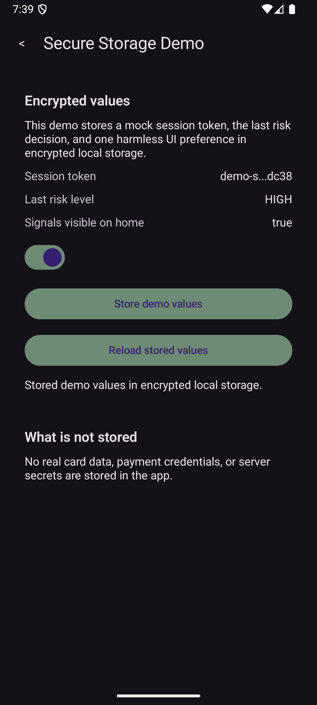<br />Secure storage demo</td>
  </tr>
  <tr>
    <td>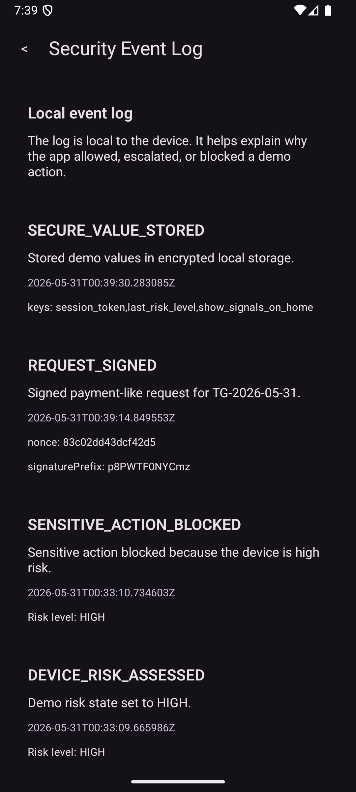<br />Security event log</td>
    <td>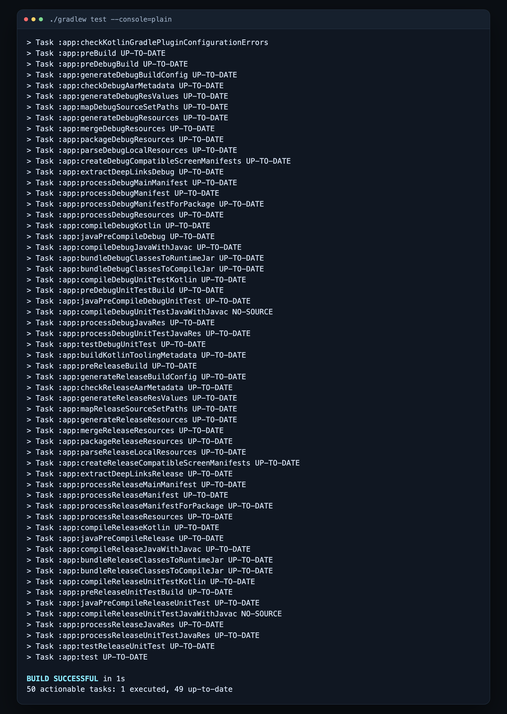<br />Fresh `./gradlew test` output</td>
  </tr>
  <tr>
    <td>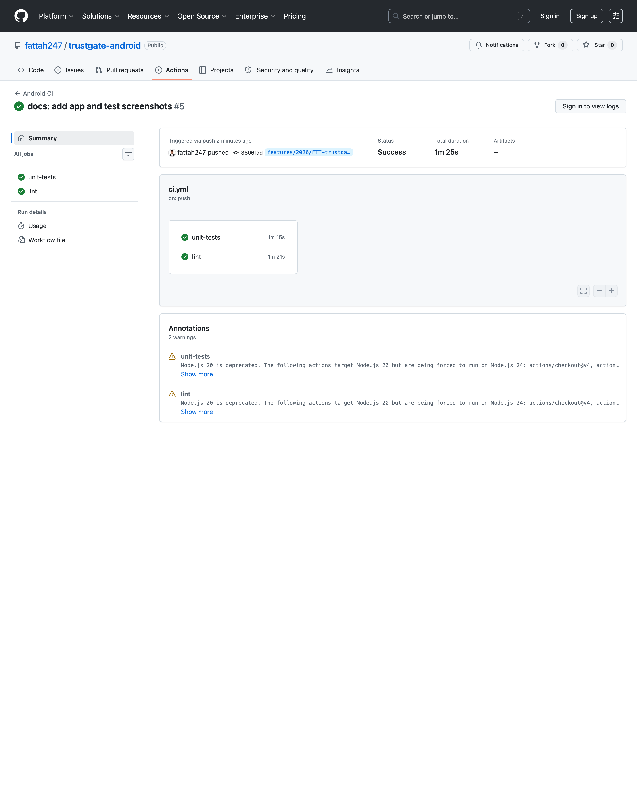<br />GitHub Actions run summary</td>
    <td>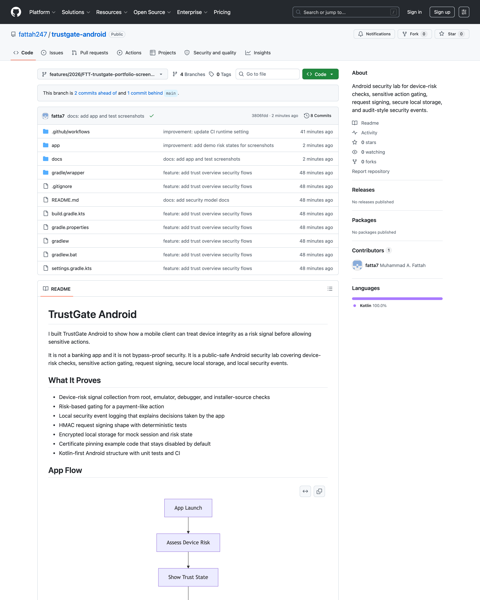<br />GitHub branch overview</td>
  </tr>
</table>

## Security Model

The app treats client-side checks as risk signals. A rooted, emulated, or debug-exposed environment does not prove malicious behavior, but it does justify more caution before allowing a sensitive action.

The request-signing flow demonstrates canonical request construction, body hashing, timestamp and nonce headers, and an HMAC signature. The demo key is intentionally local and hardcoded so the limitation is explicit.

Encrypted local storage keeps a mock session token, the last assessed risk level, and a small UI preference away from plain shared preferences.

## Run Locally

1. Install Android Studio with Android SDK Platform 35 and Build Tools 35.0.1.
2. Create a local `local.properties` or export `ANDROID_HOME` / `ANDROID_SDK_ROOT`.
3. Run:

```bash
./gradlew test
./gradlew assembleDebug
```

## Tests

Core coverage includes:

- Risk scoring to `LOW`, `MEDIUM`, and `HIGH`
- Sensitive-action decisions for all risk levels
- Deterministic request signing
- Security-event creation after assessment and blocked action

Run locally:

```bash
./gradlew test
./gradlew lint
```

## Project Structure

```text
app/src/main/java/id/fatarc/trustgate/
├── MainActivity.kt
├── core/
│   ├── crypto/
│   ├── security/
│   └── storage/
├── data/
│   └── securityevent/
├── domain/
│   ├── actiongate/
│   ├── events/
│   ├── risk/
│   └── signing/
└── ui/
    ├── about/
    ├── events/
    ├── home/
    ├── payment/
    ├── risk/
    ├── signing/
    └── storage/
```

## Limitations

- Client-side checks are not bypass-proof
- No real payment processing or bank integration
- No live device attestation backend
- No production key management for request signing
- No commercial obfuscation or anti-tamper tooling
- Certificate pinning is educational and would need rotation planning in a real app

## Docs

- [docs/THREAT_MODEL.md](docs/THREAT_MODEL.md)
- [docs/SECURITY_MODEL.md](docs/SECURITY_MODEL.md)
- [docs/SCREENSHOT_GUIDE.md](docs/SCREENSHOT_GUIDE.md)
- [docs/LIMITATIONS.md](docs/LIMITATIONS.md)
